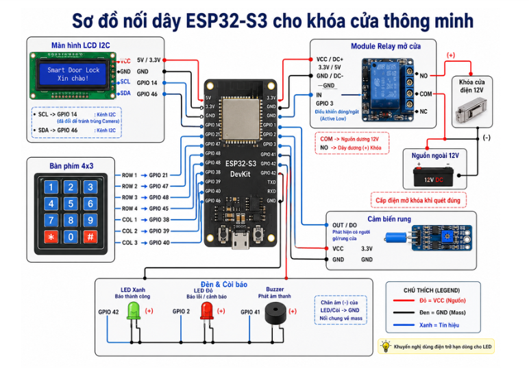
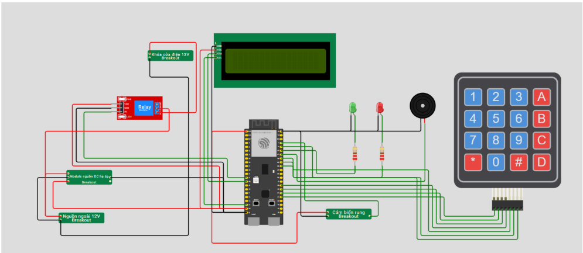

# Smart Lock IoT System

Hệ thống khóa cửa thông minh sử dụng ESP32-S3, keypad 4x3, LCD I2C, relay, cảm biến rung, đèn/còi cảnh báo và ứng dụng/server quản lý.

## Demo

Video demo dự án:

## Tổng quan dự án

Dự án mô phỏng hệ thống khóa cửa thông minh cho phép:
- Mở khóa bằng mật khẩu qua bàn phím 4x3
- Hiển thị trạng thái trên LCD I2C
- Điều khiển khóa điện 12V thông qua relay
- Cảnh báo bằng LED và buzzer khi nhập sai hoặc có rung/chấn động
- Kết nối với app/server để quản lý hoặc theo dõi trạng thái

## Cấu trúc thư mục

- `app_smart_lock`: Ứng dụng điều khiển/quản lý khóa
- `smart_lock_iot`: Code cho ESP32-S3
- `smart_lock_server`: Backend/server xử lý dữ liệu

## Phần cứng sử dụng

| Linh kiện | Chức năng |
|---|---|
| ESP32-S3 DevKit | Vi điều khiển chính |
| Keypad 4x3 | Nhập mật khẩu |
| LCD I2C 16x2 | Hiển thị thông tin |
| Relay Module | Đóng/ngắt khóa điện |
| Khóa điện 12V | Cơ cấu khóa cửa |
| Nguồn 12V | Cấp nguồn cho khóa |
| Cảm biến rung | Phát hiện va đập/cạy cửa |
| LED xanh | Báo trạng thái bình thường |
| LED đỏ | Báo lỗi/cảnh báo |
| Buzzer | Cảnh báo âm thanh |

## Sơ đồ nối mạch

### Sơ đồ tổng quan

### Sơ đồ nối dây ESP32-S3

## Kết nối chân ESP32-S3

| Thiết bị | Chân ESP32-S3 |
|---|---|
| LCD I2C - SDA | GPIO 46 |
| LCD I2C - SCL | GPIO 14 |
| Relay IN | GPIO 3 |
| Buzzer | GPIO 41 |
| LED xanh | GPIO 42 |
| LED đỏ | GPIO 2 |
| Cảm biến rung DO | GPIO 1 |
| Keypad ROW 1 | GPIO 21 |
| Keypad ROW 2 | GPIO 47 |
| Keypad ROW 3 | GPIO 48 |
| Keypad ROW 4 | GPIO 45 |
| Keypad COL 1 | GPIO 38 |
| Keypad COL 2 | GPIO 39 |
| Keypad COL 3 | GPIO 40 |

## Nguyên lý hoạt động

1. Người dùng gạt tay nắm cửa, cảm biến rung sẽ kích hoạt và chụp ảnh người dùng, nếu nhận dạng đúng thì cửa sẽ mở còn sai thì sẽ hiển số lần sai, nếu quá 4 lần thì còi sẽ cảnh báo.
2. Để nhận diện được mặt thì người dùng cần đăng ký khuôn mặt trên app trước.
3. Người dùng có thể mở khóa bằng nhập mật khẩu cố định "1357908642" vào keypad để mở cửa.
4. Người dùng cũng có thể mở khóa từ app.
5. Người dùng cũng có thể mở khóa bằng mã key tạm thời.
6. Người dùng cũng có thể xem các hình chụp cảnh báo gửi về app.

## Cách chạy dự án

### 1. IoT ESP32-S3 nối mạch và nạp code vào mạch.
### 2. Tải app về điện thoại Android: [Download Smart Lock App APK](https://github.com/USERNAME/Smart-Lock/releases/download/v1.0.0/app-release.apk)
### 3. Chạy server.
- Trước tiên, để triển khai lên server cần lưu toàn bộ cấu hình cần thiết của server vào docker image và push lên docker hub và để chế độ public
- Tiếp theo cấu hình instance trên cloud hay máy ảo bất kỳ để chạy docker container dựa trên docker image đã lưu trên dockerhub
- Kiểm tra phần logs để kiểm tra phần kết nối giữa phần mềm và phần cứng
